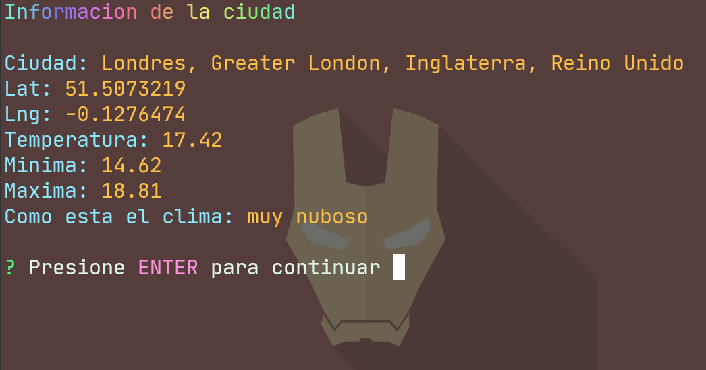

# Cli App del Clima



Esta es una aplicacion hecha en nodejs que muestra el clima en cualquier parte del mundo

## Requirements

* Tener los key de las plataformas Locationiq y OpenWeather en el archivo .env

```
LOCATIONIQ_KEY=your_key
OPENWEATHER_KEY=your_key
```

## Install dependencies

```
$ npm install
```

## Run app 

```sh
$ npm start
```

Extras:

* Wallpaper incluido en la carpeta assets
* Tema de terminal -> Dracula